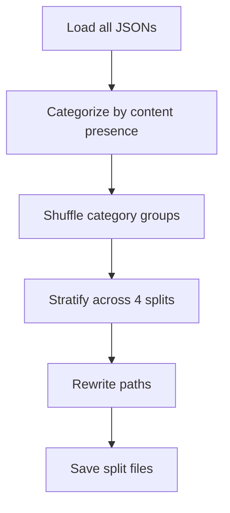

# Category classification preprocessing.ipynb

## What this notebook does
- Prepares training/test splits for video-type classification.
- Segregates videos into 3 categories based on available content.
- Distributes videos across 4 balanced splits for batch LLM processing.

## Methodology: Three Content Categories

**Category 0 (description available)**
- Videos with non-empty `metadata.description` field.
- Best case: structured, human-written content.
- Assumption: descriptions are often more reliable than derived transcripts.

**Category 1 (transcription available, no description)**
- Videos with non-empty `transcription_english` but empty/missing description.
- Format: array of timestamped subtitle lines.
- Longer content, may contain noise from auto-generated or misaligned captions.

**Category 2 (neither available)**
- Videos with no description and no English transcription.
- Only title available (fallback).
- Highest uncertainty in classification.

## Main workflow
1. Iterate all channel JSON files.
2. For each video, determine category:
   - Has description? → Category 0
   - Else has transcription? → Category 1
   - Else → Category 2
3. Shuffle within each category for randomization.
4. Split all videos across 4 balanced train/test splits.
5. Write split files: `split_1.txt`, `split_2.txt`, etc.
6. Each line: `<file_path> <category>`

## Key preprocessing steps
1. **Categorization**: Rule-based assignment by content presence.
2. **Randomization**: Shuffle within each category to avoid order biases.
3. **Stratified splitting**: Maintain category ratios across splits.
4. **Path rewriting**: Adapt paths from local/Colab to production environment.

## Flow diagram

## Notes and risks
- Assumes consistent JSON structure and field naming.
- Path rewriting critical for moving splits between environments (local ↔ Colab).
