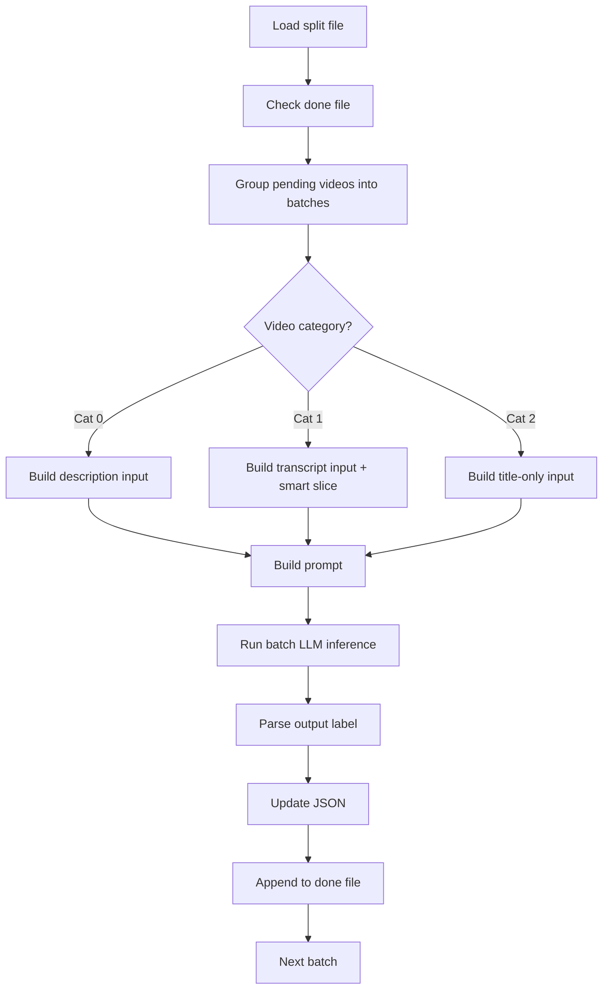
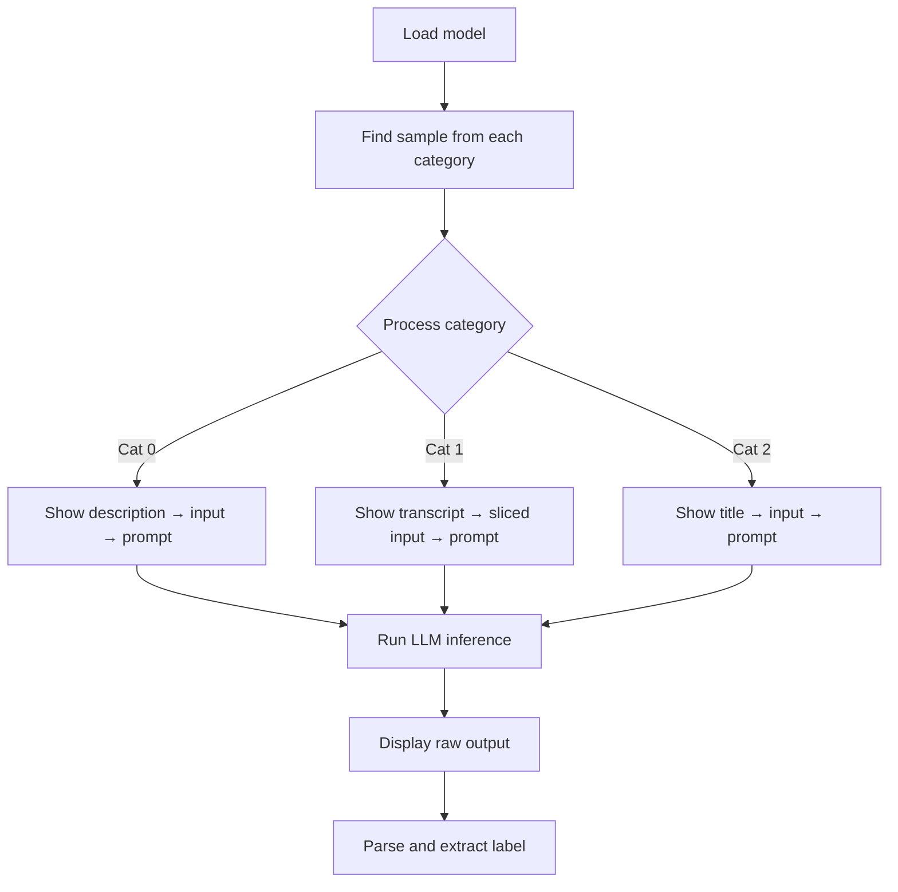

# Classification video_type category LLM.ipynb

## What this notebook does
- Batch-classifies videos into **food**, **news**, **other**, or **unpredictable** using Mistral-7B LLM.
- Processes split files (train/test sets) with crash-safe resumption.
- Updates each JSON file with final `video_type` label.

## Methodology: Three Input Strategies per Content Category

### **Category 0: Description Available**
Input format:
```
[TYPE: DESCRIPTION]
[TITLE]
<video title>
[DESCRIPTION]
<full description text>
```
- Sends full description (most reliable source).
- Structured format hints LLM about field types.

### **Category 1: Transcription Available, No Description**
Input format:
```
[TYPE: TRANSCRIPT]
[TITLE]
<video title>
[TRANSCRIPT_SNIPPET]
<smart-sliced excerpt (~4500 chars)>
[IMPORTANT_LINES]
<high-signal lines matching food/news keywords>
```
- **Timestamp removal**: regex strips `[HH:MM:SS.ms]` formatting.
- **Smart slicing**: Takes first ~1/3, middle ~1/3, and last ~1/3 of text (~4500 char limit) to preserve context while fitting token budget.
- **Signal extraction**: Identifies lines containing food or news keyword hints (`ingredients`, `cook`, `recipe`, `news`, `report`, `update`, etc.) as focus lines.
- Rationale: Reduces noise from long transcripts while preserving signal.

### **Category 2: Title Only**  
Input format:
```
[TYPE: TITLE_ONLY]
[TITLE]
<video title>
```
- Minimal context when no other content available.
- LLM must make best guess from title alone.

## Full Prompt Template
```
You are a strict classifier.

Classify the YouTube video into ONE of:
food, news, other, unpredictable

Rules:
- Output ONLY one word
- No explanation

[INPUT_TEXT_HERE]

Answer:
```

## Prompt Optimization Strategies

### **Prompt Simplification**
1. **Minimalist rules**: "Output ONLY one word" + "No explanation" eliminates verbose responses.
2. **Strict format**: Specifies 4 exact categories upfront (avoids hallucination).
3. **Persona**: "You are a strict classifier" sets inference mode to deterministic.

### **Token/Cost Optimization**
1. **Timestamp removal**: Eliminates redundant `[HH:MM:SS...]` prefixes in transcripts.
2. **Smart slicing**: Caps transcript input at ~4500 chars (fits token budget without full text).
3. **Signal line extraction**: Prioritizes lines with keyword hints, reducing LLM parsing workload.
4. **Batch processing**: Groups 8 videos per inference call for efficiency.
5. **4-bit quantization**: Mistral-7B loaded in 4-bit mode (fits in ~8GB VRAM, reduces inference time).
6. **do_sample=False**: Greedy decoding (single best path) vs sampling (faster, more consistent).

### **Quality Optimization**
1. **Category-specific formatting**: Different input templates match data type (description vs transcript vs title).
2. **Keyword hints**: Helps LLM recognize domain-specific language (e.g., "ingredients" → food).
3. **Output parsing**: Extracts valid label from potentially malformed LLM output, fallback to `unpredictable`.

## Main workflow
1. Load Mistral-7B model in 4-bit mode (GPU required).
2. Read split file and track progress in companion "done" file.
3. For each batch of ~8 videos:
   - Load JSON file and extract metadata/content.
   - Build category-specific input based on available content.
   - Construct prompt with classification instructions.
   - Run batch LLM inference.
   - Parse output and extract predicted label.
   - Update JSON with `video_type` field.
   - Append to done file (crash-safe checkpoint).
4. On re-run, skip videos already in done file.

## Key functions
- `build_cat0_input()`: formats description-based input.
- `build_cat1_input()`: formats transcript-based input with slicing/signal extraction.
- `build_cat2_input()`: formats title-only input.
- `remove_timestamps()`: regex cleanup of VTT markers.
- `smart_slice()`: context preservation via head-middle-tail extraction.
- `extract_signal_lines()`: keyword-based transcript filtering.
- `build_prompt()`: constructs final LLM prompt.
- `run_batch()`: executes batch inference with tokenizer.
- `parse_output()`: extracts valid label from LLM output.

## Flow diagram


## Notes and risks
- Requires GPU for Mistral-7B (Colab T4/A100 recommended).
- Smart slicing may lose context if important signal is not in head/middle/tail.
- Signal line extraction may miss relevant lines if keywords not pre-defined.
- Category-2 (title-only) has inherent uncertainty.

*** Add File: f:\Kirthan\Projects\Python\youtube_scraper\code doc\_test_Category classification LLM.md
# _test_Category classification LLM.ipynb

## What this notebook does
- Tests LLM prompt design and input formatting for video classification.
- Samples one video per category and shows step-by-step transformation.
- Validates prompt output parsing and label extraction logic.

## Inputs and outputs
- Inputs:
  - Mistral-7B model (4-bit quantized).
  - Sample JSON files from each category.
- Outputs:
  - Console output showing inputs, prompts, raw LLM responses, and final labels.

## Main workflow
1. Load model and tokenizer.
2. Identify and load one sample video from each category (0, 1, 2).
3. For each category:
   - Print video metadata (file path, title).
   - Build category-specific input.
   - Display final input truncated to 1000 chars.
   - Build full prompt with classification instructions.
   - Display prompt truncated to 1200 chars.
   - Run single-video LLM inference.
   - Display raw model output.
   - Parse output and extract label.
   - Display final parsed label.

## Key testing differences from production script

**Prompt variant (test vs production)**
- Test includes category definitions for clarity:
```
Definitions:
- food: cooking, recipes, ingredients, food preparation, food reviews
- news: reporting events, updates, journalism, factual reporting
- other: travel, vlog, lifestyle, entertainment not focused on food or news
- unpredictable: not enough information to decide
```
- Production prompt is simpler (only category names) to optimize token cost.

**Inference settings**
- Test: `do_sample=False, temperature=0.0` (strict greedy, most deterministic).
- Production: `do_sample=False` only (greedy, fast).

**Batch size**
- Test: single video at a time (better debugging readability).
- Production: 8 videos per batch (efficiency).

## Output parsing robustness
- Scans model output bottom-to-top (reversed order).
- Removes punctuation with regex before matching.
- Checks for both exact match and line-ending match (fallback).
- Returns `unpredictable` if no valid category found.

## Visual structure: per-category testing
For each category, output shows:
1. File path and metadata.
2. Source content (description excerpt, transcript sample, or title).
3. Input transformation (after simplification & slicing).
4. Final prompt sent to LLM.
5. Raw model output (may include prompt echo or extraneous text).
6. Extracted label (cleaned, valid).

## Flow diagram


## Notes and risks
- Test prompts are verbose for readability; production uses simplified versions.
- Single-video testing may not reveal batch-inference issues.

*** End Patch