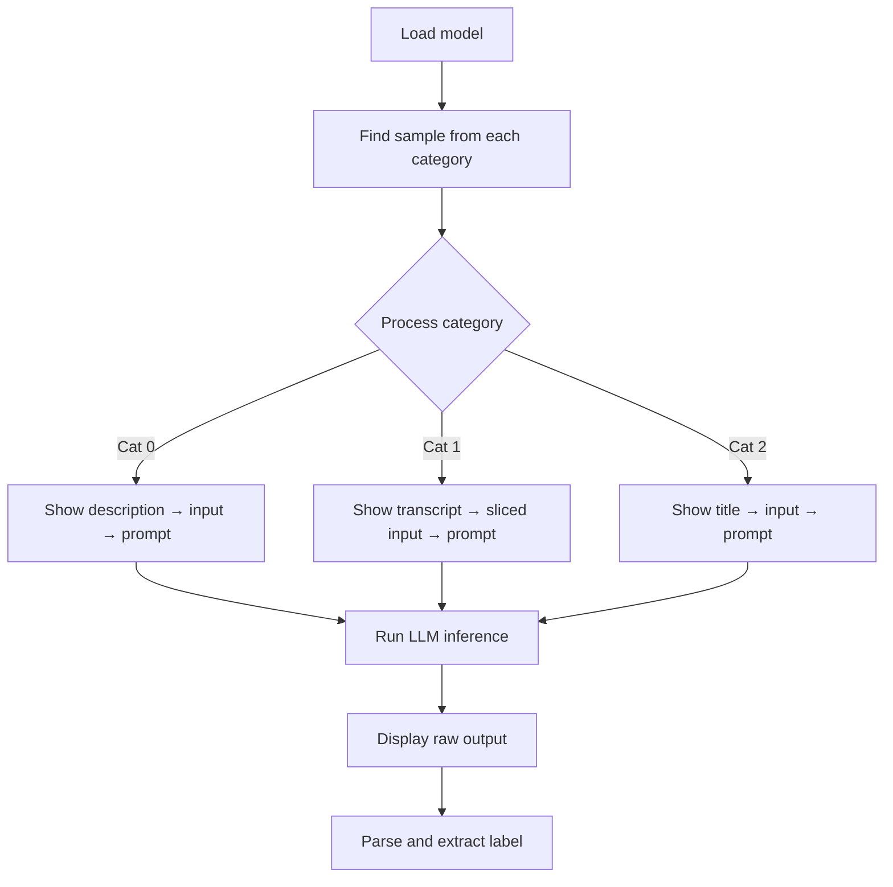

# _test_Category classification LLM.ipynb

## What this notebook does
- Tests LLM prompt design and input formatting for video classification.
- Samples one video per category and shows step-by-step transformation.
- Validates prompt output parsing and label extraction logic.

## Inputs and outputs
- Inputs:
  - Mistral-7B model (4-bit quantized).
  - Sample JSON files from each category.
- Outputs:
  - Console output showing inputs, prompts, raw LLM responses, and final labels.

## Main workflow
1. Load model and tokenizer.
2. Identify and load one sample video from each category (0, 1, 2).
3. For each category:
   - Print video metadata (file path, title).
   - Build category-specific input.
   - Display final input truncated to 1000 chars.
   - Build full prompt with classification instructions.
   - Display prompt truncated to 1200 chars.
   - Run single-video LLM inference.
   - Display raw model output.
   - Parse output and extract label.
   - Display final parsed label.

## Key testing differences from production script

**Prompt variant (test vs production)**
- Test includes category definitions for clarity:
```
Definitions:
- food: cooking, recipes, ingredients, food preparation, food reviews
- news: reporting events, updates, journalism, factual reporting
- other: travel, vlog, lifestyle, entertainment not focused on food or news
- unpredictable: not enough information to decide
```
- Production prompt is simpler (only category names) to optimize token cost.

**Inference settings**
- Test: `do_sample=False, temperature=0.0` (strict greedy, most deterministic).
- Production: `do_sample=False` only (greedy, fast).

**Batch size**
- Test: single video at a time (better debugging readability).
- Production: 8 videos per batch (efficiency).

## Output parsing robustness
- Scans model output bottom-to-top (reversed order).
- Removes punctuation with regex before matching.
- Checks for both exact match and line-ending match (fallback).
- Returns `unpredictable` if no valid category found.

## Visual structure: per-category testing
For each category, output shows:
1. File path and metadata.
2. Source content (description excerpt, transcript sample, or title).
3. Input transformation (after simplification & slicing).
4. Final prompt sent to LLM.
5. Raw model output (may include prompt echo or extraneous text).
6. Extracted label (cleaned, valid).

## Flow diagram


## Notes and risks
- Test prompts are verbose for readability; production uses simplified versions.
- Single-video testing may not reveal batch-inference issues.
