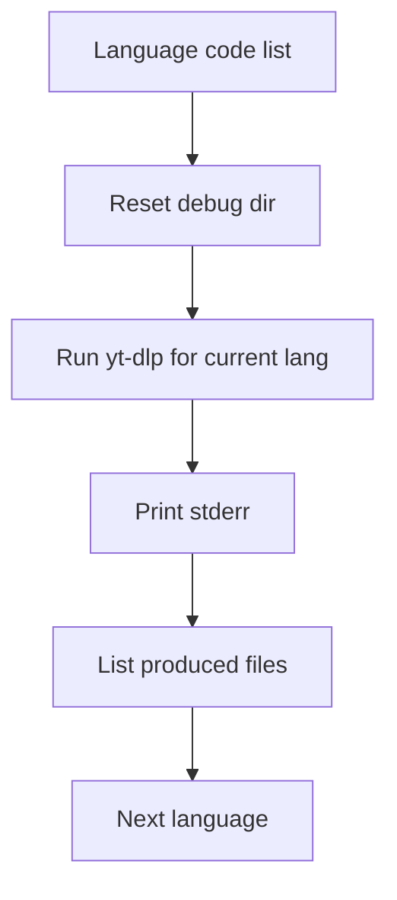

# _test_debug_lang_confusion.py

## What this file does
- Debugs subtitle language behavior by running the same video across selected language codes.
- Shows raw stderr and generated files per language request.

## Inputs and outputs
- Inputs:
  - Fixed video ID.
  - Small set of language codes.
- Outputs:
  - Language-specific debug files.
  - Stderr and file preview logs in console.

## Main workflow
1. Iterate requested language codes.
2. Clear debug folder before each run.
3. Execute language-specific `yt-dlp` subtitle command.
4. Print stderr and inspect output filenames/content.

## Flow diagram

## Notes
- Designed for language mismatch diagnosis, not for production processing.
