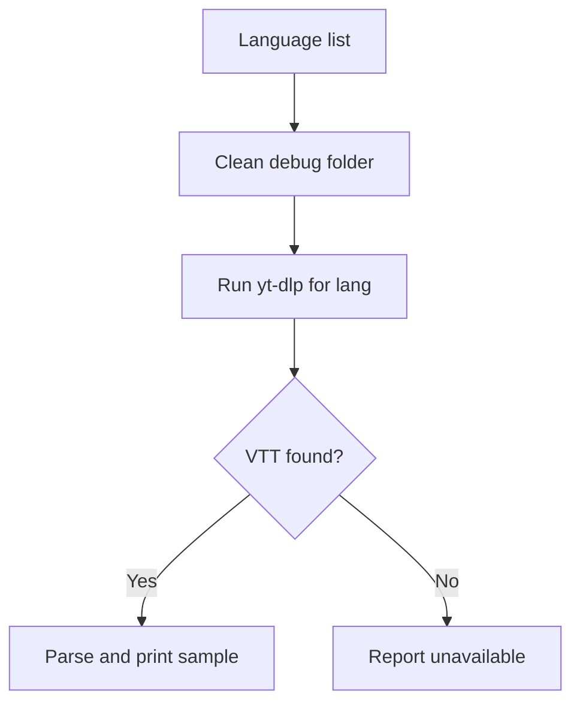

# _test_debug_list_all_subs.py

## What this file does
- Debug utility for checking subtitle availability across multiple languages.
- Adds wait intervals to avoid aggressive repeated requests.

## Inputs and outputs
- Inputs:
  - Fixed video ID.
  - Candidate subtitle language codes.
- Outputs:
  - Downloaded VTT debug files.
  - Parsed line samples in console.

## Main workflow
1. Loop over language codes.
2. Clear temp debug directory each iteration.
3. Call `yt-dlp` with language-specific subtitle request.
4. Parse first returned VTT and print sample lines.

## Flow diagram

## Notes
- Helpful for diagnosing mismatched subtitle language expectations.
