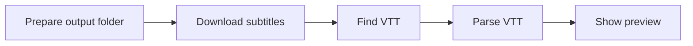

# _test_download_subs_to_folder.py

## What this file does
- Tests subtitle download behavior and file placement in a target folder.
- Parses a small preview from the downloaded VTT.

## Inputs and outputs
- Inputs:
  - Video ID, subtitle language code, output folder path.
- Outputs:
  - VTT files in selected folder.
  - Parsed preview lines in console.

## Main workflow
1. Ensure output folder exists and is clean.
2. Run `yt-dlp` subtitle download command.
3. Pick downloaded VTT file.
4. Parse and print first lines as verification.

## Flow diagram

## Notes
- Focuses on local download mechanics, not full pipeline behavior.
