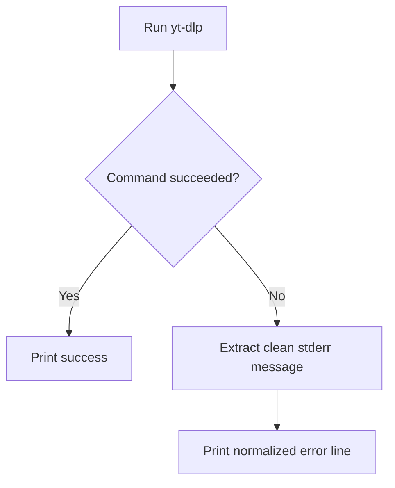

# _test_error_capture.py

## What this file does
- Validates extraction of clean, human-readable error messages from yt-dlp failures.

## Inputs and outputs
- Inputs:
  - Hardcoded test video ID and failing/edge command conditions.
  - `yt-dlp` stderr output.
- Outputs:
  - Cleaned error message in structured print format.

## Main workflow
1. Execute yt-dlp command.
2. If command fails, parse stderr for `ERROR:` lines.
3. Fallback to last useful stderr line when needed.
4. Print normalized error summary.

## Flow diagram

## Notes
- Mirrors logic used by production error-logging script.
