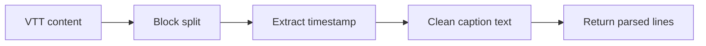

# _test_parse_vtt.py

## What this file does
- Unit-style parser test for VTT caption conversion.
- Ensures tag cleanup and timestamp extraction work correctly.

## Inputs and outputs
- Inputs:
  - A VTT file path.
- Outputs:
  - Parsed list of `[timestamp] caption` lines.

## Main workflow
1. Read VTT text and split blocks by blank lines.
2. Locate timestamp line containing `-->`.
3. Clean caption rows (strip HTML/color tags).
4. Deduplicate and return formatted lines.

## Flow diagram

## Notes
- Core parsing behavior reused by multiple pipeline scripts.
