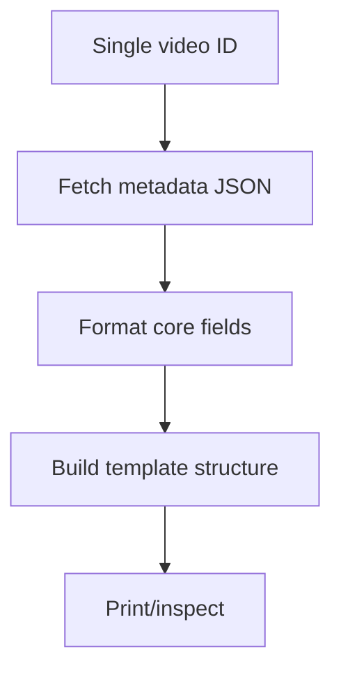

# _test_single_video_metadata.py

## What this file does
- Builds metadata template JSON for a single video as a focused test.
- Validates formatting and schema before running bulk processing.

## Inputs and outputs
- Inputs:
  - Single hardcoded video ID.
  - `yt-dlp -j` metadata response.
- Outputs:
  - Printed JSON object with metadata and placeholder sections.

## Main workflow
1. Fetch metadata JSON via yt-dlp.
2. Normalize date/duration fields.
3. Build output structure with metadata and empty arrays.
4. Print result for inspection.

## Flow diagram

## Notes
- Good debugging entry point for schema changes.
