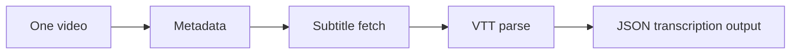

# _test_single_video_transcription.py

## What this file does
- Tests one-video transcription flow (metadata + subtitle handling).
- Useful for validating pipeline assumptions before channel-wide runs.

## Inputs and outputs
- Inputs:
  - Single video ID.
  - yt-dlp metadata and subtitle operations.
- Outputs:
  - Per-video JSON-like structure including transcription placeholders/content.

## Main workflow
1. Fetch metadata for one video.
2. Inspect subtitle availability.
3. Download and parse subtitle content if available.
4. Build/update JSON transcription section.
5. Print output for manual validation.

## Flow diagram

## Notes
- Helps isolate issues without noise from batch loops.
