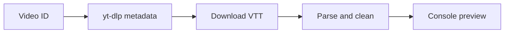

# _test_youtube_subtitles.py

## What this file does
- End-to-end test for subtitle retrieval and VTT parsing on one video.
- Verifies that subtitles can be fetched and converted to clean lines.

## Inputs and outputs
- Inputs:
  - Hardcoded video ID and target language.
  - `yt-dlp` subtitle metadata and VTT download.
- Outputs:
  - Parsed subtitle preview in console.

## Main workflow
1. Fetch video JSON metadata with `yt-dlp -j`.
2. Download subtitle file for the chosen language.
3. Parse VTT blocks to `[timestamp] text` lines.
4. Print cleaned output lines.

## Flow diagram

## Notes
- Useful as a sanity test before running large batch scripts.
