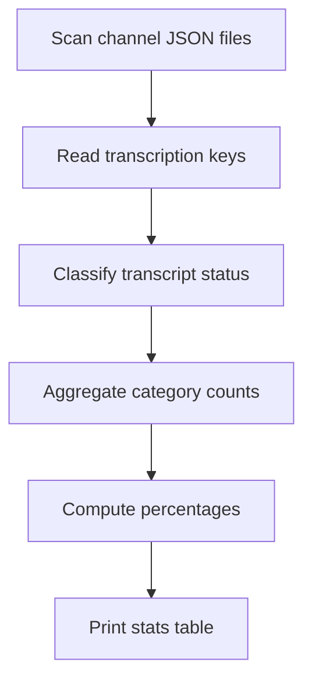

# channel_wise_transcript_stats.py

## What this file does
- Computes channel-level statistics for transcript availability.
- Reports transcript coverage across multiple scenarios.
- Prints concise ratios and percentages to compare channel quality.

## Inputs and outputs
- Inputs:
  - All channel JSON files under `data/`.
- Outputs:
  - Console table with coverage metrics.

## Main workflow
1. Walk each channel folder.
2. Read each JSON and detect transcription keys.
3. Aggregate counts for:
   - Any non-empty transcript
   - Any non-English transcript
   - Non-English + English available
   - English-only transcript
   - Missing/empty transcripts
4. Print percentage summaries channel by channel.

## Key logic blocks
- `collect_channel_stats()`: central aggregation routine.
- `fmt_ratio()`: renders readable count + percentage output.

## Flow diagram

## Notes and risks
- Treats empty arrays/empty text as missing transcript content.
- Supports legacy key naming patterns when present.
