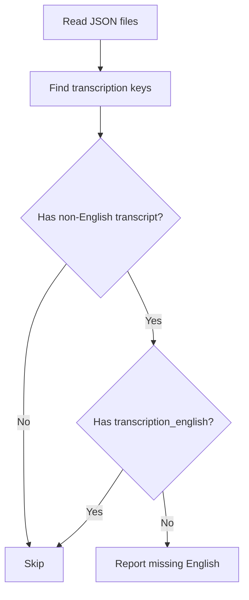

# check_missing_english_transcripts.py

## What this file does
- Finds videos that have non-English transcriptions but no English transcription.
- Helps identify files that should enter translation pipeline.

## Inputs and outputs
- Inputs:
  - All channel JSON files under `data/`.
- Outputs:
  - Console list of missing-English files.
  - Summary count of affected files.

## Main workflow
1. Traverse JSON files across channel folders.
2. Detect available `transcription_*` keys.
3. Check if at least one non-English transcript exists.
4. If English transcript is missing, flag the file.
5. Print summary at end.

## Flow diagram

## Notes and risks
- Assumes consistent naming convention for transcription keys.
- Focuses only on presence/absence, not transcript quality.
