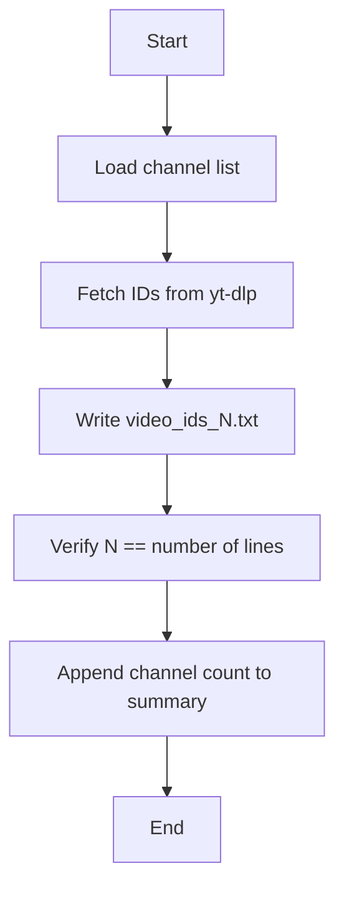

# collect_and_verify_video_ids.py

## What this file does
- Collects video IDs from a fixed list of YouTube channels.
- Saves one ID file per channel under `data/<channel>/`.
- Verifies that the ID count in the filename matches the actual number of lines.
- Writes a global summary in `data/summary_video_ids.txt`.

## Inputs and outputs
- Inputs:
  - Hardcoded channel map (channel name -> channel URL).
  - `yt-dlp` executable available in PATH.
- Outputs:
  - `data/<channel>/video_ids_<count>.txt`
  - `data/summary_video_ids.txt`

## Main workflow
1. Loop through each configured channel.
2. Fetch IDs via `yt-dlp --flat-playlist --print "%(id)s"`.
3. Save IDs to an auto-counted filename.
4. Re-open and verify that file content count equals count in filename.
5. Record per-channel counts in summary file.

## Key logic blocks
- `fetch_video_ids()`: retrieves IDs from YouTube channel URL.
- `save_channel_ids()`: writes IDs and includes count in filename.
- `verify_id_file()`: validates filename count vs line count.

## Flow diagram

## Notes and risks
- Assumes `yt-dlp` responses are stable and complete.
- Uses filename-encoded counts as a validation mechanism.
- Does not deduplicate IDs if source returns duplicates.
