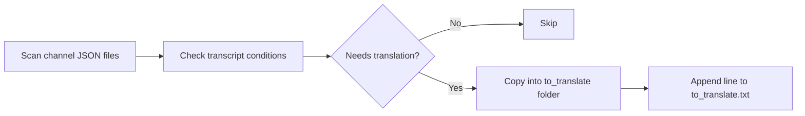

# collect_files_for_translation.py

## What this file does
- Copies translation-needed JSON files into a translation queue folder.
- Produces a mapping file so restored placement is deterministic later.

## Inputs and outputs
- Inputs:
  - Channel JSON files with transcription data.
- Outputs:
  - `data/to_translate/` containing selected JSON files.
  - `data/to_translate.txt` mapping original path to queued file path.

## Main workflow
1. Scan all JSON files in channel directories.
2. Select files with non-English transcript and missing English transcript.
3. Copy selected files to `to_translate/`.
4. Write one mapping line per copied file into `to_translate.txt`.
5. Print collection summary.

## Key logic blocks
- Transcript-key inspection for non-English vs English availability.
- Path mapping writer for round-trip restoration.

## Flow diagram

## Notes and risks
- Mapping file is critical; if corrupted, restore becomes difficult.
- Re-running can overwrite queue contents and mapping file.
