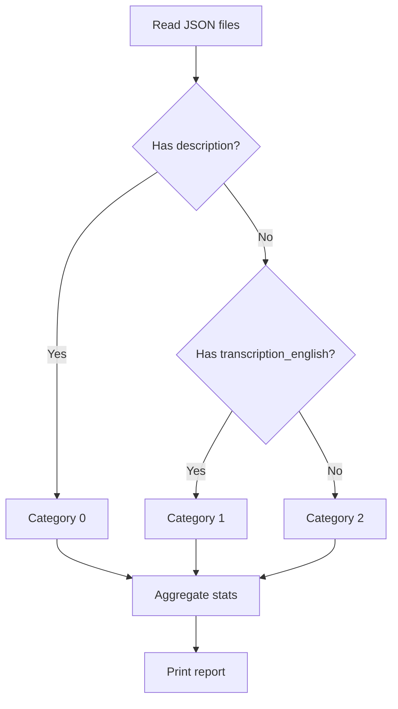

# description_transcription_stats.py

## What this file does
- Analyzes data availability patterns across all videos in the dataset.
- Reports which videos have descriptions, English transcriptions, or both.
- Helps identify content sources available for video-type classification.

## Inputs and outputs
- Inputs:
  - All JSON files across channel folders.
- Outputs:
  - Console report with per-channel and overall statistics.

## Main workflow
1. Iterate through all channel directories.
2. For each JSON file, check if `metadata.description` is non-empty.
3. Check if `transcription_english` array is non-empty.
4. Classify each video into three buckets:
   - Has description: category 0
   - No description but has English transcription: category 1
   - Neither: category 2
5. Print per-channel and cumulative totals.

## Key logic blocks
- `has_non_empty_description()`: robust check for string content.
- `has_non_empty_transcription_english()`: handles strings and arrays.
- `collect_stats_for_dir()`: aggregates counts per channel.

## Flow diagram

## Notes and risks
- Distinguishes content by available data source (description vs transcription).
- Counts are used downstream to inform classification strategy selection.
