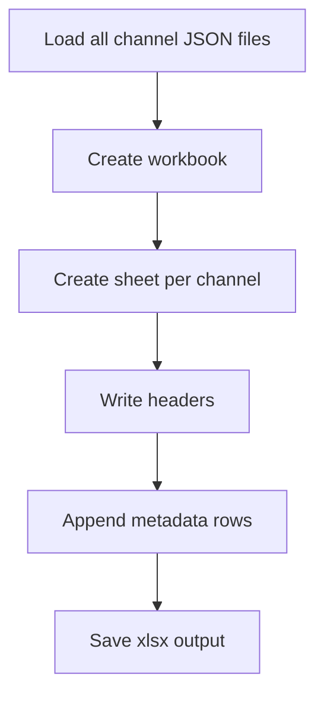

# excel_generator.py

## What this file does
- Exports channel metadata from JSON into an Excel workbook.
- Creates one sheet per channel with normalized metadata columns.

## Inputs and outputs
- Inputs:
  - Channel JSON files.
  - `openpyxl` package.
- Outputs:
  - `data/channel_metadata.xlsx`.

## Main workflow
1. Create workbook and remove default sheet.
2. For each channel, create a worksheet.
3. Add standardized header columns.
4. Append one row per JSON with metadata fields.
5. Save workbook and print totals.

## Key logic blocks
- `safe_sheet_name()`: strips invalid Excel sheet characters.
- `ingredients_to_text()`: converts ingredient arrays to readable text.
- `metadata_row()`: maps JSON schema to flat worksheet row.

## Flow diagram

## Notes and risks
- Expects stable JSON schema for metadata fields.
- Ingredient structures that are malformed may degrade cell output.
