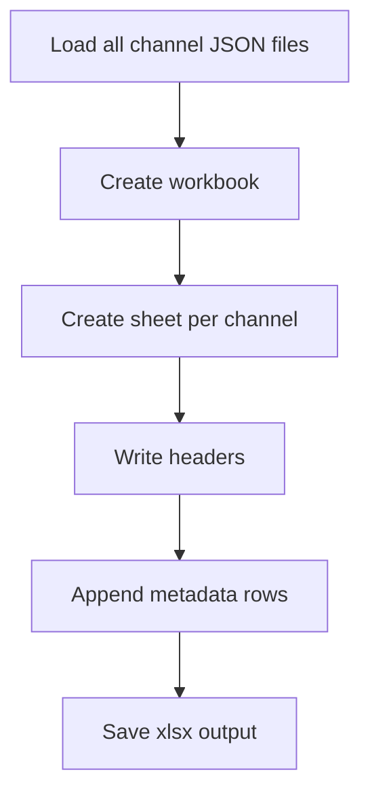

# excel_generator.py

## What this file does
- Exports channel metadata from JSON into an Excel workbook.
- Creates one sheet per channel with normalized metadata columns.
- Includes a `Video Type` column populated from each JSON file's top-level `video_type` field.

## Inputs and outputs
- Inputs:
  - Channel JSON files.
  - `openpyxl` package.
- Outputs:
  - `data/channel_metadata.xlsx`.

## Main workflow
1. Create workbook and remove default sheet.
2. For each channel, create a worksheet.
3. Add standardized header columns.
4. Read `metadata` fields and top-level `video_type` from each JSON.
5. Append one row per JSON with the standardized columns.
6. Save workbook and print totals.

## Key logic blocks
- `safe_sheet_name()`: strips invalid Excel sheet characters.
- `ingredients_to_text()`: converts ingredient arrays to readable text.
- `metadata_row()`: maps JSON schema to a flat worksheet row, including top-level `video_type`.

## Exported columns

The Excel sheets use these columns in order:

1. `File Name`
2. `Title`
3. `Video Type`
4. `Channel Name`
5. `Publish Date`
6. `View Count`
7. `Like Count`
8. `Duration`
9. `Original Audio Language`
10. `Video ID`
11. `URL`
12. `Description`
13. `Ingredients Detected`

## Flow diagram

## Notes and risks
- Expects stable JSON schema for metadata fields.
- If a JSON file has no top-level `video_type`, the `Video Type` cell is left blank.
- Ingredient structures that are malformed may degrade cell output.
