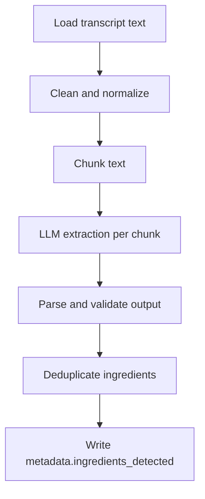

# ingredients extractor.ipynb

## What this notebook does
- Extracts likely ingredient names from transcript content using an LLM.
- Aggregates ingredient candidates from text chunks into de-duplicated results.
- Writes final ingredient list to `metadata.ingredients_detected`.

## Inputs and outputs
- Inputs:
  - JSON files with transcript text.
  - LLM model/runtime (quantized setup in notebook).
- Outputs:
  - Updated JSON files containing detected ingredients list.

## Main workflow
1. Load model and tokenizer.
2. Clean transcript lines (remove timestamp noise).
3. Chunk long text into manageable token windows.
4. Prompt model per chunk for ingredient extraction.
5. Parse returned JSON-like answers with fallbacks.
6. Deduplicate normalized ingredient names.
7. Save consolidated ingredient list back to JSON.

## Flow diagram

## Notes and risks
- LLM outputs may be malformed and need robust parsing.
- Chunk boundaries can split context and affect extraction quality.
- Heuristic deduplication can merge distinct but similar ingredients.
