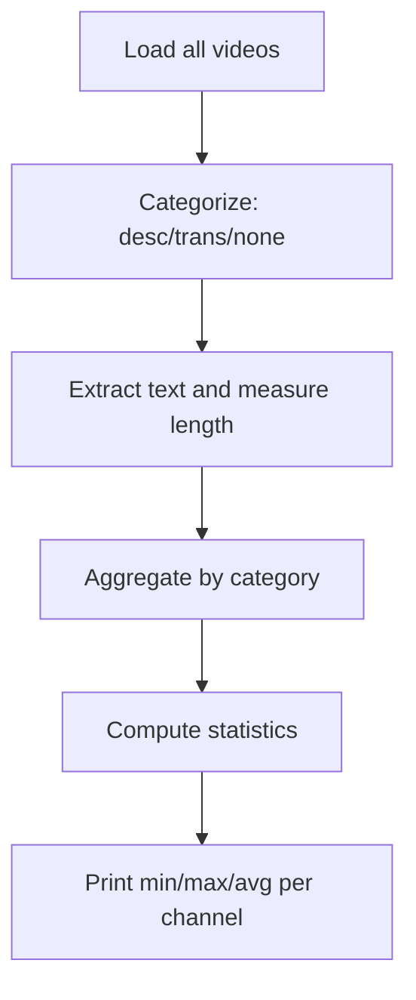

# length_analysis_classification.py

## What this file does
- Analyzes the length distribution of text content across the three categories.
- Computes min, max, and average character counts per category per channel.
- Informs batch-processing and token-limit decisions for LLM classification.

## Inputs and outputs
- Inputs:
  - Metadata and transcription JSON fields.
  - Numpy for statistical computations.
- Outputs:
  - Console table with per-category length statistics (min, max, average).

## Main workflow
1. For each channel and video, determine category (0, 1, or 2).
2. Compute usable text length:
   - Category 0: description length
   - Category 1: combined transcription_english length
   - Category 2: 0 (no text)
3. Aggregate length arrays per category per channel.
4. Print min/max/avg statistics.

## Key helper functions
- `is_non_empty()`: checks for valid content.
- `get_text_length()`: returns character count based on category.
- `get_category()`: assigns category 0, 1, or 2 per video.

## Flow diagram

## Notes
- Reveals category-specific text patterns needed for LLM input design.
- Example: Category 1 may have very long transcriptions requiring truncation.
