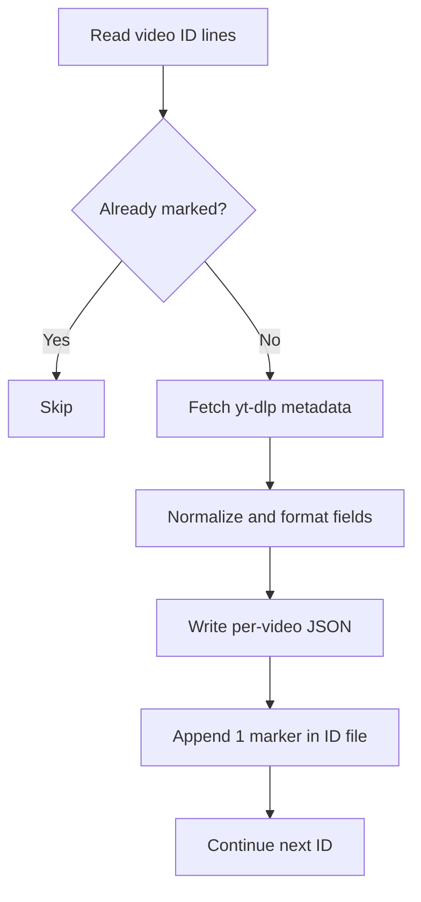

# process_youtube_metadata.py

## What this file does
- Builds metadata JSON files for every collected video ID.
- Normalizes fields like publish date, duration, and audio language.
- Creates a per-video JSON skeleton with empty transcription slot.
- Marks progress directly in the ID file using suffixes.

## Inputs and outputs
- Inputs:
  - `data/<channel>/video_ids_<count>.txt`
  - `yt-dlp -j` JSON metadata output.
- Outputs:
  - `data/<channel>/<SL>. <title-first-6-words>.json`
  - Updated ID file with completion marker (` 1`).

## Main workflow
1. Open each channel's ID file.
2. Skip lines already marked as processed.
3. Pull metadata JSON for each video.
4. Build output JSON with metadata + transcription placeholder key.
5. Save JSON and append completion marker to ID line.

## Key logic blocks
- `format_publish_date()`: transforms `YYYYMMDD` into readable format.
- `format_duration()`: converts seconds to `HH:MM:SS`.
- `normalize_language()`: maps language codes to canonical names.
- `safe_filename()`: removes filesystem-invalid characters.
- `first_six_words()`: keeps filenames readable and deterministic.

## Flow diagram

## Notes and risks
- Progress is stateful in text files, so accidental edits can break flow.
- Language mapping is finite; unknown codes may fall back.
- Per-video sequential processing can be slow for very large channels.
