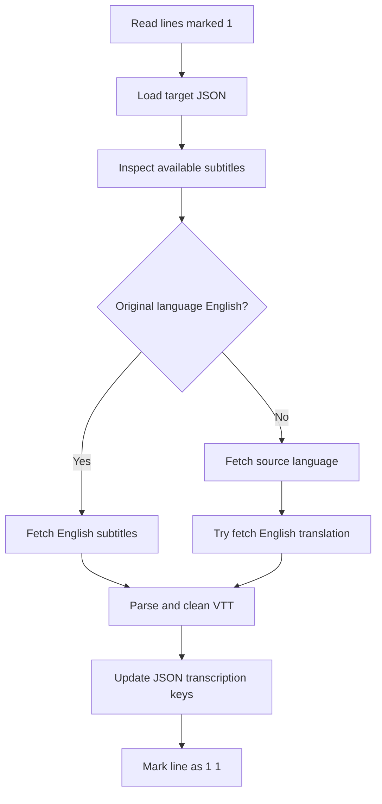

# process_youtube_transcriptions.py

## What this file does
- Downloads subtitles for videos already processed in metadata stage.
- Parses VTT subtitles into timestamped text lines.
- Writes transcriptions into each video's JSON file.
- Updates ID-file stage markers to reflect stage-2 completion.

## Inputs and outputs
- Inputs:
  - Metadata JSON files created in stage 1.
  - ID lines marked with ` 1`.
  - `yt-dlp` subtitle metadata and VTT downloads.
- Outputs:
  - Updated JSON with `transcription_<lang>` keys.
  - Updated ID lines with stage-2 marker (` 1 1`).

## Main workflow
1. Read IDs that are stage-1 complete.
2. Resolve corresponding JSON file by serial number.
3. Query available subtitles (manual + auto).
4. Download VTT in required language(s).
5. Parse VTT -> clean text -> deduplicate lines.
6. Persist transcription arrays back to JSON.
7. Mark ID line as stage-2 complete.

## Key logic blocks
- `yt_cmd_base()`: central command builder for subtitle operations.
- `download_and_parse()`: download VTT then parse into list entries.
- `parse_vtt()`: extracts timestamps and caption text from VTT blocks.
- `clean_caption_text()`: removes tags/markup and normalizes spaces.
- `process_video()`: selects subtitle strategy per language condition.

## Flow diagram

## Notes and risks
- Subtitle availability varies by video/region/network conditions.
- Deduplication can remove repeated lines that are semantically useful.
- Temporary subtitle files must be cleaned to avoid stale parsing.
