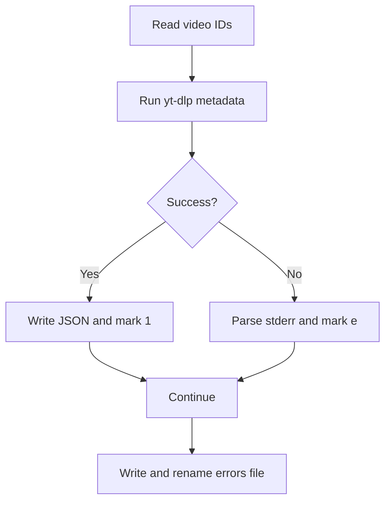

# process_youtube_with_error_logging.py

## What this file does
- Performs metadata extraction like stage 1.
- Adds explicit error capture and per-channel error logging.
- Marks failed IDs with ` e` and successful IDs with ` 1`.

## Inputs and outputs
- Inputs:
  - Channel ID files.
  - `yt-dlp` metadata calls.
- Outputs:
  - Per-video metadata JSON files.
  - `errors.txt` renamed to `errors_<count>.txt`.
  - Updated ID markers (` 1` or ` e`).

## Main workflow
1. Iterate unprocessed video IDs.
2. Fetch metadata via `yt-dlp`.
3. On success, build and save JSON + append ` 1` marker.
4. On failure, extract a clean error message + append ` e` marker.
5. Write all channel errors to log file and rename with total count.

## Key logic blocks
- `extract_clean_error()`: strips noisy stderr to useful message.
- `count_existing_errors()`: validates current error-log volume.
- Metadata formatting helpers mirror stage-1 script.

## Flow diagram

## Notes and risks
- Relies on stderr patterns (`ERROR:`) for clean extraction.
- Marker-based state must remain consistent with downstream scripts.
- Re-runs may change error counts and renamed files.
