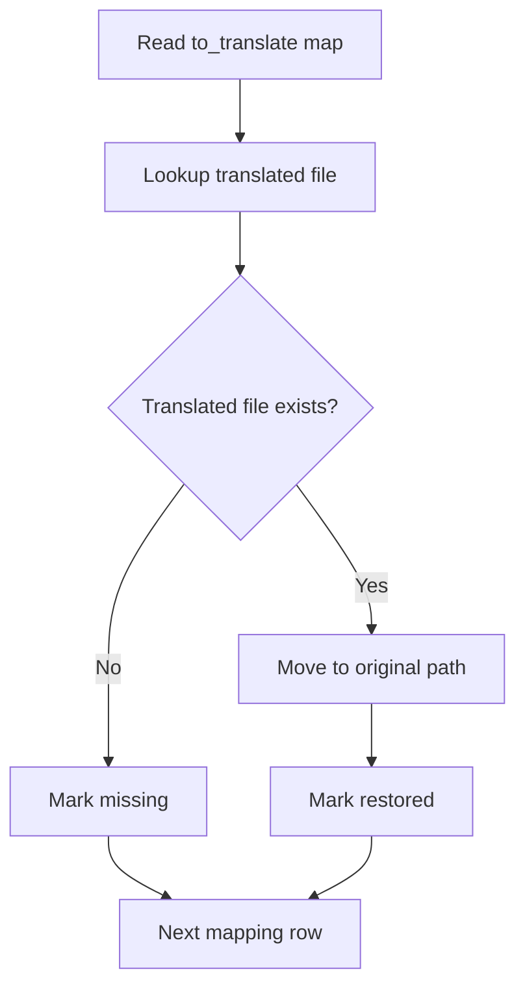

# restore_translated_files.py

## What this file does
- Moves translated JSON files back from translation folder to original locations.
- Uses `to_translate.txt` mapping as ground truth for destination paths.

## Inputs and outputs
- Inputs:
  - `data/to_translate.txt` (original_path | queued_path map).
  - `data/translated/` folder containing translated JSON files.
- Outputs:
  - Restored files in channel folders (overwritten originals).
  - Console summary of restored and missing files.

## Main workflow
1. Read mapping lines from `to_translate.txt`.
2. For each mapping entry, find translated file in `translated/`.
3. Validate destination directory exists.
4. Move file into original location.
5. Track restored and missing counts for summary.

## Flow diagram

## Notes and risks
- Performs overwrites; keep backups if needed.
- Depends completely on mapping quality and filename consistency.
