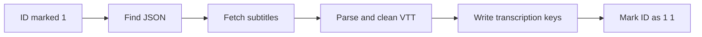

# stage2_transcription.py

## What this file does
- Runs subtitle downloading/parsing as stage 2 after metadata creation.
- Updates each JSON with transcription fields.
- Uses ID-file markers to control what is eligible for processing.

## Inputs and outputs
- Inputs:
  - ID lines with ` 1` marker.
  - Existing metadata JSON files.
  - `yt-dlp` subtitle downloads.
- Outputs:
  - JSON files with populated transcription fields.
  - ID lines updated to ` 1 1`.

## Main workflow
1. Identify stage-1-complete videos from ID file.
2. Resolve JSON target by serial number.
3. Download source-language and/or English subtitles.
4. Parse VTT captions into timestamped arrays.
5. Write transcriptions into JSON and mark completion.

## Flow diagram

## Notes and risks
- Operationally overlaps with `process_youtube_transcriptions.py`.
- Best used as explicit second-stage run in a two-pass pipeline.
