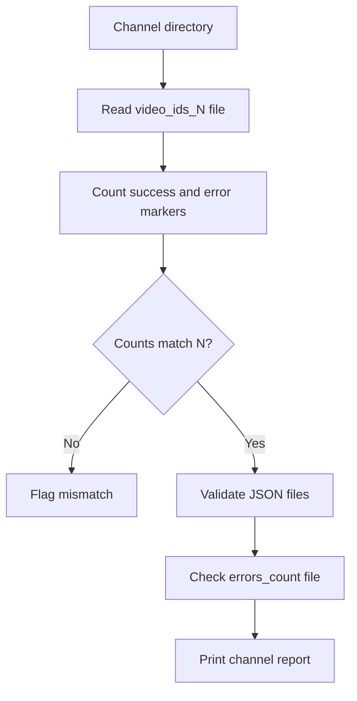

# verify_youtube_stage2.py

## What this file does
- Validates whether stage-2 processing is complete and consistent.
- Checks marker counts, expected totals, and JSON structure quality.
- Cross-checks existence of channel error logs.

## Inputs and outputs
- Inputs:
  - `video_ids_<N>.txt` files.
  - `errors_<count>.txt` files.
  - Per-video JSON files.
- Outputs:
  - Console verification report per channel.

## Main workflow
1. Parse expected total videos from ID filename.
2. Count successful markers (` 1`) and error markers (` e`).
3. Validate that success + error equals expected total.
4. Verify expected error file exists when errors are present.
5. Validate each successful JSON has required fields and one transcription key.

## Key logic blocks
- `parse_expected_total()`: reads `N` from filename pattern.
- `load_error_file()`: reads and validates error-log records.
- `validate_json_file()`: enforces metadata/transcription schema checks.

## Flow diagram

## Notes and risks
- Uses filename convention as source of truth for expected totals.
- Validates structure, not semantic correctness of transcript content.
