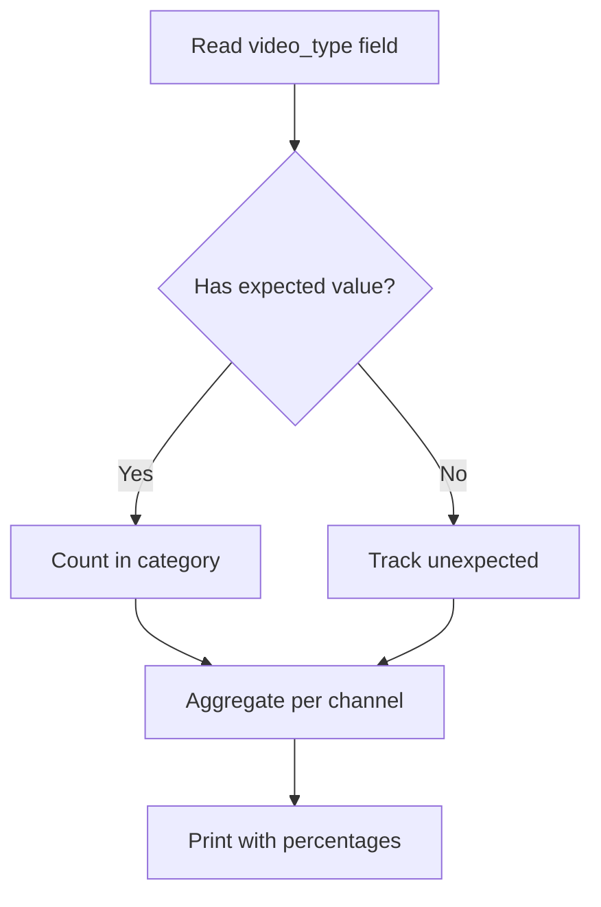

# video_type_stats.py

## What this file does
- Reports classification coverage and distribution of video_type labels.
- Tallies how many videos have been classified and into which categories.
- Identifies unexpected or missing classifications.

## Inputs and outputs
- Inputs:
  - All JSON files with `video_type` field.
- Outputs:
  - Per-channel breakdown with percentages.
  - Overall summary across all channels.

## Main workflow
1. Scan all JSON files.
2. Check presence of `video_type` key.
3. Normalize classification value (lowercase, strip).
4. Count videos in expected categories: `food`, `news`, `other`, `unpredictable`.
5. Track unexpected values for quality review.
6. Print per-channel and cumulative reports.

## Four classification categories
- **food**: cooking, recipes, ingredients, food preparation, reviews
- **news**: reporting events, updates, journalism, factual reporting
- **other**: travel vlogs, lifestyle, entertainment (not specifically food/news)
- **unpredictable**: insufficient information to classify confidently

## Key logic blocks
- `normalize_video_type()`: strips and lowercases classification values.
- `collect_channel_stats()`: aggregates counts and unexpected values.
- `pct()`: computes percentage with zero-safety.

## Flow diagram

## Notes and risks
- Unexpected values flagged for review; may indicate classification errors.
