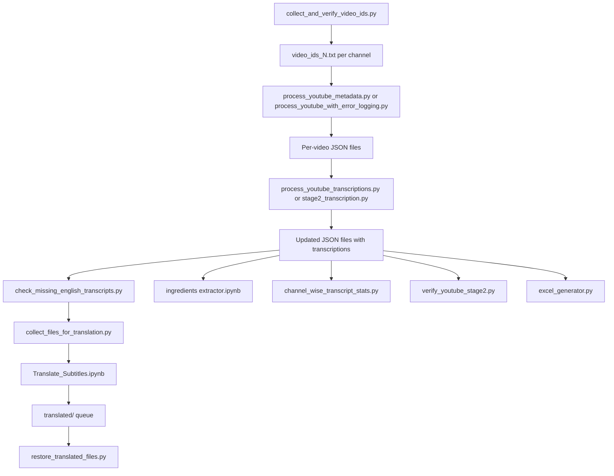

# YouTube Scraper Pipeline

This repository is organized around a single end-to-end flow:

1. Discover YouTube video IDs for a fixed set of channels.
2. Build per-video metadata JSON files.
3. Download and parse subtitles into transcription arrays.
4. Optionally translate missing English transcripts.
5. Extract ingredient names from transcripts.
6. Validate, summarize, and export the collected data.

The code and documentation folders are intentionally paired 1:1. The `code/` folder contains the executable scripts and notebooks, and `code doc/` contains the matching written notes for each file.

## Repository Layout

| Folder | Role |
| --- | --- |
| `code/` | Executable scripts and notebooks that perform each pipeline stage. |
| `code doc/` | Human-readable documentation for each code file. |
| `data/` | All active inputs, outputs, queues, reports, and channel JSON files. |

## Active Channels

The pipeline is hard-coded around these five channels:

- `masterchefnambie`
- `delhifoodwalks`
- `northeastindiafood`
- `roohi_haflongbar`
- `main_bhi_bharat`

## Data Model

Each channel gets its own folder under `data/`. The canonical file types are:

- `video_ids_<N>.txt`: the source list of video IDs for that channel.
- `<SL>. <title-first-6-words>.json`: the per-video metadata and transcript record.
- `errors_<N>.txt`: optional error log for failed metadata runs.
- `data/to_translate/`: queue of JSON files that need translation.
- `data/translated/`: translated JSON files waiting to be restored to their original locations.
- `data/channel_metadata.xlsx`: Excel export of metadata across all channels.

Historical snapshots also exist in the root `data/` folder, including `*_old` folders, `*.zip` archives, and legacy text files. These are archival artifacts, not the active working paths used by the current scripts.

## ID File State Machine

The `video_ids_<N>.txt` file is the pipeline state tracker. Each line begins as a raw video ID and is then updated in place.

| Marker | Meaning |
| --- | --- |
| no suffix | Unprocessed. |
| ` 1` | Metadata has been created for that video. |
| ` 1 1` | Subtitles/transcriptions have been processed. |
| ` e` | Metadata extraction failed and the error was logged. |

The filename count is also part of the contract: `video_ids_<N>.txt` means the file should contain exactly `N` video IDs.

## End-to-End Flow



## Stage 0. Collect Video IDs

### Script

- `code/collect_and_verify_video_ids.py`

### Matching docs

- `code doc/collect_and_verify_video_ids.md`

### What it does

This is the bootstrap step. It queries each hard-coded channel with `yt-dlp --flat-playlist --print "%(id)s"`, writes one ID file per channel, and records a channel summary in `data/summary_video_ids.txt`.

### Inputs

- Channel URL map embedded in the script.
- `yt-dlp` available on the machine.

### Outputs

- `data/<channel>/video_ids_<N>.txt`
- `data/summary_video_ids.txt`

### Notes

- The file name stores the expected count and is later used for verification.
- The script also re-opens each generated file to make sure the count in the name matches the actual number of lines.

## Stage 1. Metadata Extraction

### Script

- `code/process_youtube_metadata.py`

### Matching docs

- `code doc/process_youtube_metadata.md`

### What it does

This stage reads each `video_ids_<N>.txt` file, fetches full metadata with `yt-dlp -j`, and writes a per-video JSON file. The script also normalizes the publish date, duration, and audio language fields.

### Inputs

- `data/<channel>/video_ids_<N>.txt`
- `yt-dlp -j` metadata response for each video

### Outputs

- `data/<channel>/<SL>. <title-first-6-words>.json`
- Updated ID file lines marked with ` 1`

### JSON shape created here

```json
{
  "metadata": {
    "title": "...",
    "channel_name": "...",
    "publish_date": "YYYY-MM-DD",
    "view_count": 0,
    "like_count": 0,
    "duration": "HH:MM:SS",
    "original_audio_language": "english",
    "video_id": "...",
    "url": "...",
    "description": "...",
    "ingredients_detected": []
  },
  "transcription_<lang>": []
}
```

The transcription key is chosen from the normalized audio language. For English videos, this is usually `transcription_english`; for non-English videos, it uses the normalized language name.

### Important behavior

- The script processes only the first `video_ids_*.txt` file it finds in each channel folder.
- It rewrites the ID file after each successful video so the run can resume after interruption.
- Unknown language codes fall back to the raw code string.

## Stage 1b. Metadata Extraction With Error Logging

### Script

- `code/process_youtube_with_error_logging.py`

### Matching docs

- `code doc/process_youtube_with_error_logging.md`

### What it does

This is a more defensive version of the metadata stage. It performs the same metadata creation work, but on failures it extracts a cleaner error message, appends the ID line marker ` e`, and logs the failure in `errors.txt` before renaming that file to `errors_<N>.txt`.

### Inputs

- Channel ID files
- `yt-dlp -j` metadata calls

### Outputs

- Per-video JSON files on success
- `data/<channel>/errors_<N>.txt`
- Updated ID lines with ` 1` or ` e`

### Notes

- This script is the best choice when you want failure tracking instead of silent skips.
- It uses stderr parsing to isolate the most relevant `yt-dlp` error line.

## Stage 2. Subtitle Download and Transcription

### Scripts

- `code/process_youtube_transcriptions.py`
- `code/stage2_transcription.py`

### Matching docs

- `code doc/process_youtube_transcriptions.md`
- `code doc/stage2_transcription.md`

### What it does

This stage runs after metadata creation. It reads the stage-1-complete ID lines, finds the matching JSON file by serial number, inspects available subtitles and auto-captions, downloads the best available VTT file, parses it into cleaned timestamped lines, and writes transcription arrays back into the JSON.

### Inputs

- JSON files written in stage 1
- ID lines marked with ` 1`
- Subtitle metadata from `yt-dlp -j`
- VTT downloads from `yt-dlp`

### Outputs

- Updated JSON files with `transcription_*` keys
- Updated ID file lines marked ` 1 1`

### Subtitle selection logic

The scripts use the original audio language from the metadata and then choose subtitles with a prefix-based fallback.

- If the original audio is English, they try English creator subtitles first, then English auto captions.
- If the original audio is non-English, they try the original language first, then English subtitles or English translation.
- The download helpers prefer creator subtitles over auto captions when both are available.

### Parsing logic

The VTT parser does the following:

1. Split the VTT file into blank-line-separated blocks.
2. Find the row containing `-->`.
3. Extract the start timestamp.
4. Clean caption rows by removing `<00:00:00.000>` style tags and `<c>` styling tags.
5. Join the caption rows into a single line.
6. Deduplicate repeated final lines.
7. Emit lines in the format `[HH:MM:SS.mmm] text`.

### Local temp folders used here

- `_subs_tmp/` under each channel folder in the main scripts.

### Important note

The stage-2 writers can populate more than one transcription key for a single JSON when a non-English video also has English subtitles. The verifier described later is stricter and expects exactly one transcription key, so that mismatch should be treated as a known pipeline inconsistency.

## Translation Candidate Discovery

### Script

- `code/check_missing_english_transcripts.py`

### Matching docs

- `code doc/check_missing_english_transcripts.md`

### What it does

This script scans all channel JSON files and reports videos that have at least one non-English transcription key but no `transcription_english` key.

### Use in the pipeline

It acts as a discovery filter for the translation queue. If a video has, for example, `transcription_hindi` but no English transcript, it is a candidate for translation.

## Translation Queue Preparation

### Script

- `code/collect_files_for_translation.py`

### Matching docs

- `code doc/collect_files_for_translation.md`

### What it does

This script scans every JSON file under `data/`, selects only the files with non-English transcripts and no English transcript, copies them into `data/to_translate/`, and writes a path mapping into `data/to_translate.txt`.

### Inputs

- Existing channel JSON files

### Outputs

- `data/to_translate/`
- `data/to_translate.txt`

### Mapping format

Each mapping line is:

```text
original_path | final_path
```

### Important behavior

- The queue folder is recreated if needed.
- The mapping file is overwritten on each run, so it is the single source of truth for restoration.
- Only files with a non-empty non-English transcription and no English transcription are copied.

## Translation Notebook

### Notebook

- `code/Translate_Subtitles.ipynb`

### Matching docs

- `code doc/Translate_Subtitles.md`

### What it does

This notebook batch-translates timestamped English subtitle lines into multiple target languages using the NLLB-200 model. It preserves the original timestamps and rewrites the text portion into new `transcription_<lang>` arrays.

### Inputs

- JSON files in the translation queue
- `transcription_english` arrays
- Hugging Face model and tokenizer

### Outputs

- Updated JSON files containing new language-specific transcription keys

### Notes

- The notebook is a manual step and is typically run in a GPU-enabled environment.
- The repo also contains `data/to_translate.zip` and `data/translated.zip`, which are archive snapshots of queue state rather than the active working mechanism.

## Restoring Translated Files

### Script

- `code/restore_translated_files.py`

### Matching docs

- `code doc/restore_translated_files.md`

### What it does

This script reads `data/to_translate.txt`, looks for the translated file by filename inside `data/translated/`, and moves each translated JSON back to its original channel location.

### Inputs

- `data/to_translate.txt`
- `data/translated/`

### Outputs

- Restored JSON files in the original channel folders
- Console counts for restored and missing files

### Important behavior

- The restore step uses the filename from the translated queue item, not the original directory path.
- It overwrites the original JSON file in place.

## Ingredients Extraction

### Notebook

- `code/ingredients extractor.ipynb`

### Matching docs

- `code doc/ingredients extractor.md`

### What it does

This notebook extracts ingredient names from transcript text, typically from the English transcript or the primary transcript available in the JSON, and writes the deduplicated result to `metadata.ingredients_detected`.

### Inputs

- JSON files with transcript text
- An LLM runtime, described in the notebook as a quantized Mistral-based setup

### Outputs

- Updated JSON files with `metadata.ingredients_detected`

### Processing steps

1. Clean timestamped transcript lines.
2. Chunk long transcript text into smaller windows.
3. Prompt the model for ingredient extraction.
4. Parse the model response.
5. Deduplicate ingredient candidates.
6. Write the consolidated list back into the JSON.

### Notes

- The notebook is another manual/interactive stage.
- Chunk boundaries and model output quality are the main sources of variance.

## Validation and Reporting

### Stage-2 verifier

- Script: `code/verify_youtube_stage2.py`
- Doc: `code doc/verify_youtube_stage2.md`

This script validates that the state markers and JSON outputs are internally consistent.

It checks:

- The expected total from `video_ids_<N>.txt`.
- The count of ` 1` and ` e` markers.
- The existence and line count of `errors_<N>.txt` when failures are present.
- The JSON structure for successful items.

### Transcript coverage stats

- Script: `code/channel_wise_transcript_stats.py`
- Doc: `code doc/channel_wise_transcript_stats.md`

This script prints per-channel transcript coverage metrics, including:

- Any non-empty transcript
- Any non-English transcript
- Non-English plus English present
- English-only transcript
- No transcript or empty transcript keys

It also prints a few sample files with no transcript keys for manual follow-up.

### Metadata export

- Script: `code/excel_generator.py`
- Doc: `code doc/excel_generator.md`

This script builds `data/channel_metadata.xlsx`, one worksheet per channel, using the metadata from each JSON file.

## Test and Debug Utilities

These are not part of the production pipeline, but they document and verify the lower-level behaviors that the pipeline depends on.

| Code file | Matching doc | Purpose |
| --- | --- | --- |
| `code/_test_parse_vtt.py` | `code doc/_test_parse_vtt.md` | Unit-style VTT parser check. |
| `code/_test_youtube_subtitles.py` | `code doc/_test_youtube_subtitles.md` | End-to-end subtitle retrieval and parsing sanity test. |
| `code/_test_single_video_metadata.py` | `code doc/_test_single_video_metadata.md` | Single-video metadata template test. |
| `code/_test_single_video_transcription.py` | `code doc/_test_single_video_transcription.md` | Single-video metadata + subtitle flow test. |
| `code/_test_download_subs_to_folder.py` | `code doc/_test_download_subs_to_folder.md` | Subtitle download placement test. |
| `code/_test_error_capture.py` | `code doc/_test_error_capture.md` | Error message cleanup test for `yt-dlp` failures. |
| `code/_test_debug_list_all_subs.py` | `code doc/_test_debug_list_all_subs.md` | Checks which subtitle languages are actually available. |
| `code/_test_debug_lang_confusion.py` | `code doc/_test_debug_lang_confusion.md` | Compares subtitle behavior across language requests. |

### Debug folders used by the tests

- `subs_tmp/`
- `subs_debug/`
- `lang_debug/`

These are temporary diagnostic folders only. They are not part of the canonical data model.

## File-to-Doc Map

The repository keeps a dedicated markdown note for each executable file.

| Code file | Doc file |
| --- | --- |
| `code/collect_and_verify_video_ids.py` | `code doc/collect_and_verify_video_ids.md` |
| `code/process_youtube_metadata.py` | `code doc/process_youtube_metadata.md` |
| `code/process_youtube_with_error_logging.py` | `code doc/process_youtube_with_error_logging.md` |
| `code/process_youtube_transcriptions.py` | `code doc/process_youtube_transcriptions.md` |
| `code/stage2_transcription.py` | `code doc/stage2_transcription.md` |
| `code/collect_files_for_translation.py` | `code doc/collect_files_for_translation.md` |
| `code/restore_translated_files.py` | `code doc/restore_translated_files.md` |
| `code/check_missing_english_transcripts.py` | `code doc/check_missing_english_transcripts.md` |
| `code/channel_wise_transcript_stats.py` | `code doc/channel_wise_transcript_stats.md` |
| `code/verify_youtube_stage2.py` | `code doc/verify_youtube_stage2.md` |
| `code/excel_generator.py` | `code doc/excel_generator.md` |
| `code/Translate_Subtitles.ipynb` | `code doc/Translate_Subtitles.md` |
| `code/ingredients extractor.ipynb` | `code doc/ingredients extractor.md` |
| `code/_test_parse_vtt.py` | `code doc/_test_parse_vtt.md` |
| `code/_test_youtube_subtitles.py` | `code doc/_test_youtube_subtitles.md` |
| `code/_test_single_video_metadata.py` | `code doc/_test_single_video_metadata.md` |
| `code/_test_single_video_transcription.py` | `code doc/_test_single_video_transcription.md` |
| `code/_test_download_subs_to_folder.py` | `code doc/_test_download_subs_to_folder.md` |
| `code/_test_error_capture.py` | `code doc/_test_error_capture.md` |
| `code/_test_debug_list_all_subs.py` | `code doc/_test_debug_list_all_subs.md` |
| `code/_test_debug_lang_confusion.py` | `code doc/_test_debug_lang_confusion.md` |

## Practical Run Order

If you want the active pipeline in the order it is typically executed, it is:

1. `collect_and_verify_video_ids.py`
2. `process_youtube_metadata.py` or `process_youtube_with_error_logging.py`
3. `process_youtube_transcriptions.py` or `stage2_transcription.py`
4. `check_missing_english_transcripts.py`
5. `collect_files_for_translation.py`
6. `Translate_Subtitles.ipynb`
7. `restore_translated_files.py`
8. `ingredients extractor.ipynb`
9. `verify_youtube_stage2.py`
10. `channel_wise_transcript_stats.py`
11. `excel_generator.py`

## Operational Caveats

- The metadata and transcription scripts rely on stateful marker edits inside the ID files, so manual edits can break resumption logic.
- Both stage-2 scripts process only IDs that already end in ` 1`.
- The verifier expects exactly one transcription key per successful JSON, while the subtitle stage can create more than one transcription key for some non-English videos.
- Translation queue generation overwrites `data/to_translate.txt` on each run.
- Restoring translated files depends on filename matching inside `data/translated/`.
- The notebooks are interactive stages and are not automatically chained by the Python scripts.

## Bottom Line

The pipeline is a channel-by-channel YouTube ingestion flow that starts with ID discovery, turns each video into a normalized JSON record, enriches those records with subtitles and optional translations, extracts ingredient metadata, and finally validates and exports the result. The active working state lives in `data/`, and the ID files are the main source of truth for progress.